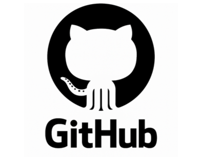

# **P01: GitHub – Forks i Pull Requests**

## **Breu Descripció**

* L’objectiu és aprendre a treballar **col·laborativament** amb GitHub, simulant el flux professional d’EverPia.
* Es tracta de **dominar forks, branques i pull requests**, no només pujar arxius.
* Aquesta tasca reflecteix el **procés real d’onboarding i revisió de codi** a la consultora.

## **Flux de Treball a EverPia**

1. **Assignació de rols dins l’equip:**

   * **Team Leader (Líder d’Equip)**
   * **Membres de l’Equip**
2. **Fork del repositori base:**

   * Repositori base: [EverPia-Core](https://github.com/SMX2m/EverPia-Onboarding)
3. **Creació de branques de treball:**

   * Cada membre treballa en la seva pròpia branca per implementar canvis o afegir arxius.
4. **Commit i Push:**

   * Desar els canvis localment i pujar-los al vostre fork.
5. **Pull Request (PR):**

   * Demanar al líder d’equip que revisi els canvis i fusioni la branca al repositori principal.

## **Objectius Clau**

* Dominar el **flux col·laboratiu de GitHub**.
* Aprendre a **gestionar branques, commits i pull requests**.
* Simular el **procés d’onboarding i revisió de codi** d’una consultora professional.

## **Materials i Suport**

* Guia de l’activitat: [Projecte04-GuiaGitHub](https://github.com/SMX2n/Projecte04-GuiaGitHub)
