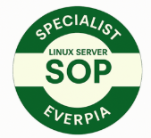

# **T08: Auditoria de Qualitat i Estandardització de Servidors**

*Tasca individual*

## **Breu Descripció**

## **Introducció**

Benvinguts, equip.

Durant les darreres setmanes, hem implementat serveis complexos per als nostres clients:

* servidors de fitxers (**NFS**),
* sistemes d’impressió (**CUPS**),
* serveis d’autenticació (**LDAP**),
* i altres components crítics.

Però cap d'aquests serveis pot funcionar de manera fiable si **els fonaments del servidor** no són sòlids.

Un servidor amb:

* configuració de xarxa incorrecta,
* permisos inadequats,
* serveis innecessaris actius,
* o paquets sense actualitzar,

…és un **risc de seguretat**, una font de **vulnerabilitats**, i una incidència garantida.
A EverPia, la nostra reputació es basa en la **robustesa i estandardització**.

---

# **La Vostra Missió: Auditoria + Estandardització del Servidor Base**

Abans de desplegar nous serveis avançats, consolidarem la base.
Aquesta activitat és una **auditoria interna** i una pràctica del nostre:

> **Protocol de Desplegament Estàndard (SOP — Standard Operating Procedure)**.

Heu de demostrar que sou capaços de:

1. **Desplegar una màquina virtual Ubuntu Server des de zero**.
2. **Aplicar el protocol de configuració bàsica d’EverPia**, que garanteix que qualsevol servidor té:

   * estructura clara,
   * seguretat mínima assegurada,
   * configuració homogènia,
   * i control adequat.

Aquestes tasques són fonamentals: *tot consultor júnior ha de dominar-les* abans de posar les mans a un entorn real d’un client.

Prepareu-vos: un cop completada la fase d’entrenament, haureu de superar una **prova pràctica de validació** per obtenir la certificació **SOP-Specialist**.

---

# **Fase d’Entrenament**

Per practicar els vostres coneixements, i a partir de la **OVA disponible**, haureu de realitzar les tasques incloses al document:

📄 **Projecte4-TascaSOP** (disponible per descarregar).

### Important:

* **No cal entregar cap activitat en aquesta fase.**
* L’objectiu és comprendre profundament el funcionament del servidor i els passos del protocol SOP.
* Aquesta pràctica és indispensable per superar la certificació.

---

# **Certificació SOP-Specialist**

Ha arribat el dia.

Ja esteu preparats per demostrar la vostra competència i assolir el nivell **SOP Specialist**, superant un **examen pràctic exigent** que posarà a prova:

* seguretat bàsica,
* configuració estàndard,
* gestió de paquets i serveis,
* permisos i estructura del sistema,
* i bones pràctiques de desplegament.

### Condicions de l’examen:

* Només podreu portar **un únic full manuscrit**
  amb les anotacions que considereu necessàries.
* No es permet material digital ni consultes externes.

Aquesta prova és el primer pas per ser considerats **consultors operatius** dins d’EverPia.

