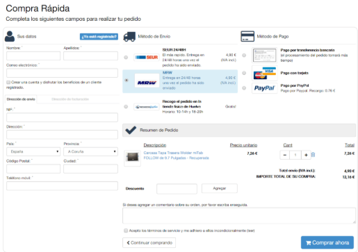

# **T12: Fonaments del Disseny Web Comercial — Landing Page + Procés de Checkout**

*Tasca individual*

## **Breu Descripció**

Aquesta classe magistral té com a objectiu explicar **l’estructura de les pàgines web comercials**, centrant-se en:

* **Landing Page**: La primera impressió que rep l’usuari quan arriba a la web.
* **Procés de Checkout**: El recorregut de l’usuari fins a completar la compra.

Abans de dissenyar la maqueta completa de l’e-commerce per al client d’EverPia, és essencial entendre **aquests dos pilars**, ja que defineixen l’experiència de l’usuari i afecten directament les conversions i vendes.

---

## **Objectius d’Aprenentatge**

1. Comprendre la funció i estructura d’una **Landing Page**:

   * Capçalera i hero section
   * Beneficis i USP (Unique Selling Proposition)
   * Crides a l’acció (CTA)
   * Seccions de confiança i testimonis

2. Analitzar el **Procés de Checkout**:

   * Passos típics: Carret → Dades de client → Pagament → Confirmació
   * Reducció de friccions per millorar conversions
   * Elements clau: formularis simples, indicadors de progrés, opcions de pagament

3. Visualitzar el **recorregut de l’usuari** des de l’arribada a la web fins a la finalització de la compra.

[https://gamma.app/docs/Disseny-de-Landing-Pages-i-Checkout-amb-Figma-nm6pbvd5d8q6vfo](https://gamma.app/docs/Disseny-de-Landing-Pages-i-Checkout-amb-Figma-nm6pbvd5d8q6vfo)

---

## **Exemples**

* **Landing Page extensa:** [romualdfons.com/monetizacion-webs](https://romualdfons.com/monetizacion-webs/)
* **Exemple de pantalles de Checkout:** (imatges proporcionades al material de la classe)

